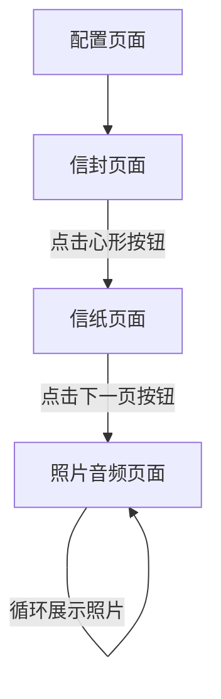

# 生日祝福网页 - 产品需求文档 (PRD)

## 1. 产品概述
一个精美的三页式生日祝福网页，通过信封、信纸和照片音频展示三个页面，为用户创造温馨浪漫的生日祝福体验。
- 目标用户：想要为亲友制作个性化生日祝福的用户
- 核心价值：提供高度定制化、真实感强、交互丰富的生日祝福体验

## 2. 核心功能

### 2.1 用户角色
| 角色 | 说明 |
|------|------|
| 创建者 | 输入祝福文字、上传照片和音频，生成生日祝福网页 |
| 接收者 | 浏览生日祝福网页，体验完整的祝福流程 |

### 2.2 功能模块
1. **第一页 - 信封页面**：展示精美信封，心形按钮触发进入下一页
2. **第二页 - 信纸页面**：逐字显示祝福文字，透明按钮跳转下一页
3. **第三页 - 照片音频页面**：环形展示照片，同步播放音频

### 2.3 页面详情
| 页面名称 | 模块名称 | 功能描述 |
|----------|----------|----------|
| 信封页面 | 信封组件 | 中央展示可爱风格信封，心形按钮居中，点击跳转 |
| 信封页面 | 背景组件 | 生日主题背景图，温馨浪漫氛围 |
| 信纸页面 | 信纸组件 | 中央展示信纸，逐字显示用户输入的祝福文字，间隔0.3秒 |
| 信纸页面 | 导航按钮 | 底部透明按钮"下一页"，点击跳转 |
| 照片音频页面 | 照片轮播 | 环形展示最多8张照片，循环播放 |
| 照片音频页面 | 音频播放器 | 进入页面自动播放，底部显示播放进度和时长 |
| 配置页面 | 文字输入 | 用户输入祝福文字内容 |
| 配置页面 | 照片上传 | 用户上传最多8张照片 |
| 配置页面 | 音频上传 | 用户上传背景音乐 |
| 配置页面 | 预览模式 | 预览完整生日祝福效果 |

## 3. 核心流程

### 3.1 用户流程描述
1. 用户进入配置页面，输入祝福文字、上传照片和音频
2. 点击预览按钮，进入信封页面
3. 点击心形按钮，进入信纸页面
4. 观看逐字显示的祝福文字
5. 点击"下一页"按钮，进入照片音频页面
6. 欣赏环形展示的照片和同步播放的音乐

### 3.2 流程图

## 4. 用户界面设计

### 4.1 设计风格
- **主色调**：温馨粉色、浪漫紫色、金色点缀
- **按钮风格**：圆角、柔和阴影、心形按钮
- **字体**：优雅的手写风格字体，温馨可爱
- **布局风格**：居中对称，简洁大气
- **图标/装饰**：爱心、星星、气球、蛋糕等生日元素

### 4.2 页面设计概览
| 页面名称 | 模块名称 | UI元素 |
|----------|----------|--------|
| 信封页面 | 信封 | 可爱卡通风格，粉色系，心形按钮带有脉动动画 |
| 信封页面 | 背景 | 温馨生日主题背景，柔和渐变，装饰性元素 |
| 信纸页面 | 信纸 | 复古信纸风格，淡雅底色，精美边框 |
| 信纸页面 | 文字显示 | 手写字体，逐字淡入效果 |
| 信纸页面 | 按钮 | 透明背景，白色边框，悬停效果 |
| 照片音频页面 | 照片展示 | 3D环形旋转效果，柔和阴影 |
| 照片音频页面 | 音频控制器 | 简洁进度条，时间显示，播放/暂停按钮 |

### 4.3 响应式设计
- 桌面优先设计，适配移动端
- 触摸优化，支持移动设备手势操作

### 4.4 动画效果
- 信封页面：心形按钮脉动动画，信封轻微浮动
- 信纸页面：逐字淡入效果，页面过渡动画
- 照片音频页面：3D环形旋转，照片切换过渡

## 5. 技术约束
- 高速加载：优化资源大小，使用懒加载
- 真实感：精美的视觉效果和流畅的动画
- 兼容性：支持主流浏览器
