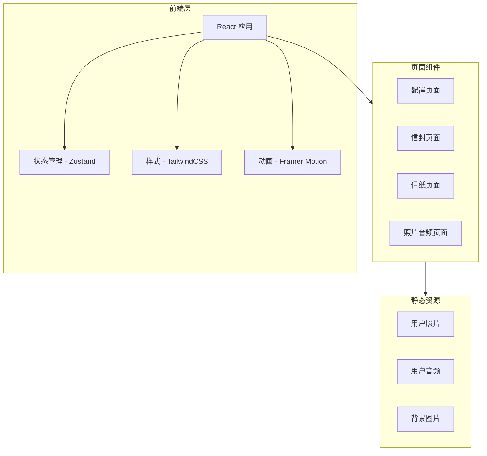
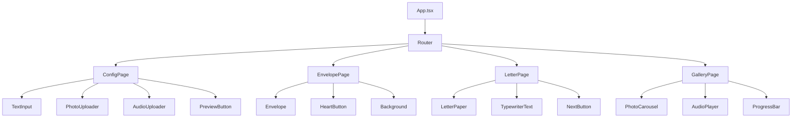

# 生日祝福网页 - 技术架构文档

## 1. 架构设计


## 2. 技术说明
- **前端框架**: React@18 + TypeScript
- **构建工具**: Vite
- **样式方案**: TailwindCSS@3
- **动画库**: Framer Motion
- **状态管理**: Zustand (轻量级状态管理)
- **路由**: React Router DOM
- **后端**: 无 (纯前端应用)
- **数据存储**: LocalStorage (保存用户配置)

## 3. 路由定义
| 路由 | 用途 |
|------|------|
| `/` | 配置页面 - 用户输入文字、上传照片和音频 |
| `/envelope` | 信封页面 - 第一页，展示信封和心形按钮 |
| `/letter` | 信纸页面 - 第二页，逐字显示祝福文字 |
| `/gallery` | 照片音频页面 - 第三页，环形展示照片和播放音频 |

## 4. 组件架构


## 5. 状态管理设计
```typescript
interface BirthdayState {
  // 用户输入
  letterContent: string;
  photos: string[]; // Base64 或 URL
  audioFile: string | null; // Base64 或 URL
  
  // 操作方法
  setLetterContent: (content: string) => void;
  addPhoto: (photo: string) => void;
  removePhoto: (index: number) => void;
  setAudio: (audio: string) => void;
  resetAll: () => void;
}
```

## 6. 性能优化策略
- **图片优化**: 压缩上传图片，使用 WebP 格式
- **懒加载**: 照片按需加载
- **代码分割**: 按路由分割代码
- **资源预加载**: 预加载下一页资源
- **缓存策略**: 使用 LocalStorage 缓存用户配置

## 7. 文件结构
```
birthday-wishes/
├── public/
│   └── assets/
│       ├── envelope.svg
│       ├── letter.svg
│       └── background.jpg
├── src/
│   ├── components/
│   │   ├── Envelope/
│   │   ├── LetterPaper/
│   │   ├── PhotoCarousel/
│   │   ├── AudioPlayer/
│   │   └── ConfigPanel/
│   ├── pages/
│   │   ├── ConfigPage.tsx
│   │   ├── EnvelopePage.tsx
│   │   ├── LetterPage.tsx
│   │   └── GalleryPage.tsx
│   ├── store/
│   │   └── useBirthdayStore.ts
│   ├── hooks/
│   │   └── useTypewriter.ts
│   ├── styles/
│   │   └── globals.css
│   ├── App.tsx
│   └── main.tsx
├── package.json
├── vite.config.ts
└── tailwind.config.js
```

## 8. 关键技术实现

### 8.1 逐字显示效果
- 使用 `setInterval` 每 300ms 显示一个字符
- 支持暂停和继续
- 显示完成后触发回调

### 8.2 照片环形展示
- 使用 CSS 3D Transform 实现环形布局
- 自动旋转动画
- 支持最多 8 张照片

### 8.3 音频同步播放
- 使用 HTML5 Audio API
- 进度条实时更新
- 支持播放/暂停控制

### 8.4 页面过渡动画
- 使用 Framer Motion 实现流畅过渡
- 淡入淡出效果
- 缩放和位移组合
